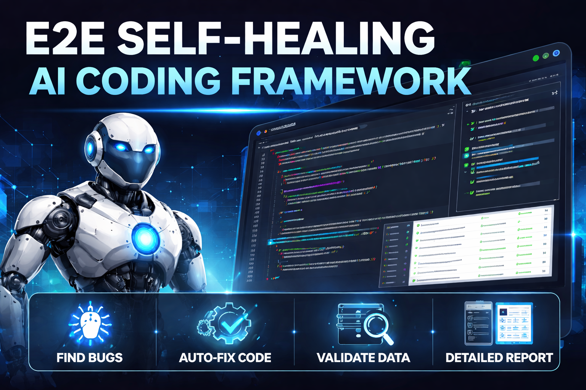

# Link-in-Bio Page Builder



A full-stack link-in-bio page builder where users can create a personalized page with links, headers, and dividers — similar to Linktree. Built with Next.js 15, React 19, and Neon Postgres.

## Documentation

- [Sobre o Projeto](public/sobre.html) — Visao geral completa da aplicacao, stack, banco de dados e API
- [Self-Healing AI Workflow](public/ia-validacao.html) — Como o sistema de auto-validacao com IA funciona

## Features

- **Email/Password Authentication** — Sign up, log in, and session management via Neon Auth
- **Profile Editor** — Edit display name, bio, and avatar URL with a live phone-frame preview
- **Link Management** — Add links, section headers, and dividers
- **Drag-and-Drop Reorder** — Rearrange items with dnd-kit drag handles
- **Live Preview** — Real-time preview panel that mirrors the public page layout
- **Responsive Layout** — Side-by-side editor/preview on desktop, tab toggle on mobile
- **Save with Feedback** — Explicit save button with toast notifications

## Tech Stack

- **Framework:** Next.js 15 (App Router, `src/` directory)
- **UI:** React 19, Tailwind CSS v4, shadcn/ui, Lucide icons
- **Database:** Neon Postgres + Drizzle ORM
- **Auth:** Neon Auth (`@neondatabase/auth`)
- **Drag-and-Drop:** dnd-kit
- **Validation:** Zod
- **Testing:** Vitest (unit), agent-browser (E2E)
- **Linting/Formatting:** Biome

## Getting Started

### Prerequisites

- Node.js 18+
- A [Neon](https://neon.tech) project with Auth enabled

### Setup

1. **Install dependencies:**

   ```bash
   npm install --legacy-peer-deps
   ```

2. **Configure environment variables:**

   ```bash
   cp .env.example .env.local
   ```

   Fill in your Neon database URL, auth base URL, and cookie secret.

3. **Push the database schema:**

   ```bash
   npm run db:push
   ```

4. **Start the dev server:**

   ```bash
   npm run dev
   ```

   Open [http://localhost:3000](http://localhost:3000) in your browser.

> **Note:** Do not use `--turbopack` — middleware does not execute with Turbopack in Next.js 15.

## Project Structure

```
src/
├── app/
│   ├── (auth)/          # Signup + Login pages
│   ├── (dashboard)/     # Editor page
│   └── api/             # Profile, links, links/reorder, slug/check routes
├── components/
│   ├── auth/            # Signup/login forms, slug input
│   ├── editor/          # Link list, link item, add button, profile form, toolbar
│   ├── preview/         # Phone-frame preview panel
│   ├── themes/          # Minimal theme (reusable for public pages)
│   └── ui/              # shadcn/ui primitives
├── db/                  # Drizzle schema + connection
├── hooks/               # useProfile data fetching hook
├── lib/                 # Validations, rate limiter, utils
├── middleware.ts        # Route protection for /editor, /analytics, /settings
└── types/               # Shared TypeScript types
```

## Scripts

| Command | Description |
|---------|-------------|
| `npm run dev` | Start dev server |
| `npm run build` | Production build |
| `npm run lint` | Lint with Biome |
| `npm run lint:fix` | Auto-fix lint issues |
| `npm run format` | Format with Biome |
| `npm run test` | Run unit tests (watch mode) |
| `npm run test:run` | Run unit tests once |
| `npm run test:e2e` | Run E2E tests |
| `npm run db:push` | Push schema to database |
| `npm run db:generate` | Generate Drizzle migrations |
| `npm run db:studio` | Open Drizzle Studio |
